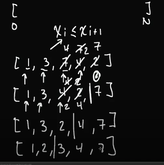

# BUBBLE SORT

every first iteration in the bubble sort we ll always make the largest number be the last num in the array

so we can ignore the last and we inc it one by one each iteration (see the picture above)
