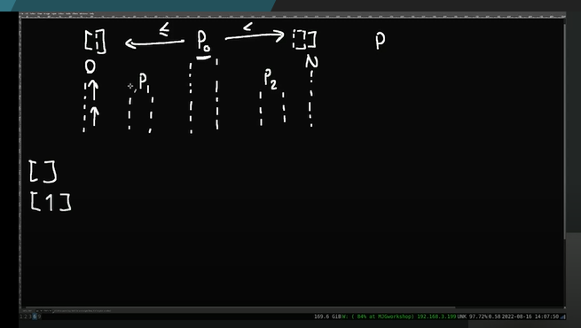
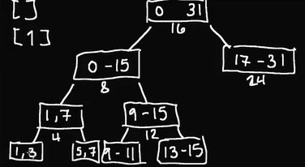
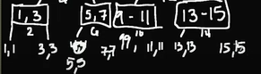

# QUICK SORT ALGORITHM

DIVIDE AND CONQUER ALGORITHM (one of many algo strategies [greedy (linear?), dynamic programming, etc])

split things into parts, and we solve it in each part

u can resplit it until it become a fundemental unit that can be solved easily

### ----

LOW ---- HIGH
0 ------- > N
[ --------- ]

we pick some element in the array (doesnt matter waht element is),

we pick p (pivot)
we iterate the arr, the smaller/equal num are before the p and the bigger one is after the p

then how to pick p (pivot) ?
in the middle?

we split it again and again until we come to empty array and single array [1]

Low point ---p--- High Point

1. get the middle
2. smaller and equal is before p (pivot) and bigger or greater after p (pivot)
3. after that we split the array again before p and after p,
4. we re gonna resplit it again and to the point 2 instruction again till
5. the splitted arr is empty = [] or the length of the splitted arr is 1 = [1]

RUNNING TIME O(N Log N)
n/2^k = 1

quick sort doesnt always sort quickly
WHEN ? and WHY ?

when we encounter reversed sorted arr and we dont use middle p (pivot)
when we sort reversed sorted arr with quicksort we will get (n(n+1))/2 or so we called it O(N^2)

so the runtime is in the interval O(n logn) - O(n^2)

so what is the strategy ::: ALWAYS PICK THE MIDDLE ELEMENT
